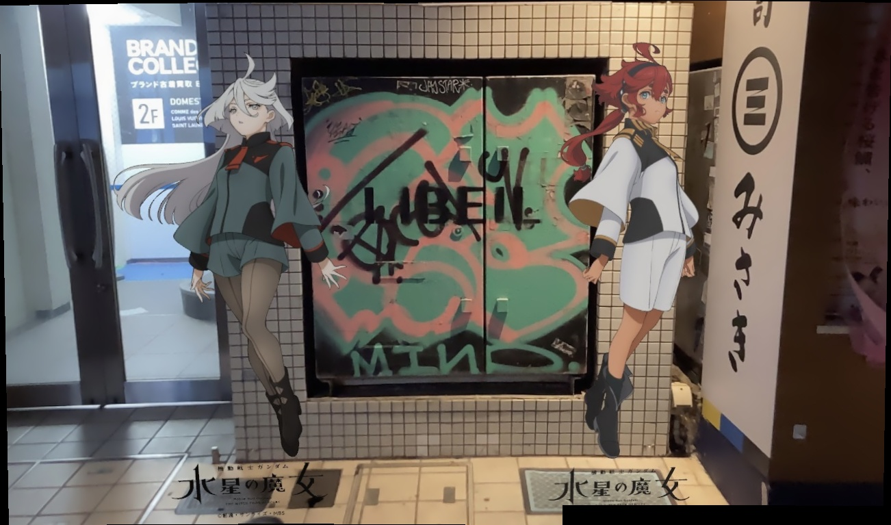

# OpenCV Stitcher Example

🦝「ミオリネさんミオリネさん、わたしたち同じ場所でたくさん写真撮ってるのに、ふたりで写ってるものがありませんね」

🍅「お互いにシャッター切ってたからね」

🦝「なんか寂しいですね、ずっと同じ場所を巡ってたのに」

🍅「アプリでくっつけちゃえばいいんじゃない？」

🦝「探してみたけど意外と無いんですよね…」

🍅「ん、ニカにこのまえ聞いたOpenCVが使えるかも」

```sh
./build.sh
ln -s images_1 images
./run.sh
```



🦝「すごい！わたしたちひとつになれましたね！」

🍅「言い方がキモい（本当はすごく嬉しい）」


## 説明

- [#水星の魔女渋谷に現る](https://twitter.com/HobbySite/status/1634751579143421952?s=20)で提供されたARコンテンツで撮ったスレとミオの写真を1枚にしたいのでOpenCVのStitcherモジュールを試してみました
- ChatGPTが教えてくれたコードほぼそのままです
- スティッチがうまくいかない画像もあるので調査中…

## 使い方

実行にはDockerが必要です.

```sh
./build.sh
rm images  # 既にシンボリックリンク images がある場合
ln -s images_1 images
./run.sh
```

実行が完了すると `stitched_image.jpg` がカレントディレクトリに生成されます.
